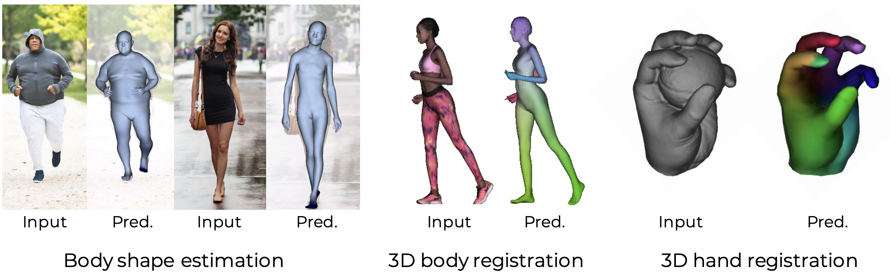

- [human motion capture](https://github.com/visonpon/human-motion-capture)
- [Awesome 3D Generation](https://github.com/justimyhxu/awesome-3D-generation)
- [Awesome Neural Radiance Fields ](https://github.com/yenchenlin/awesome-NeRF)
- [neuralfields](https://neuralfields.cs.brown.edu/index.html)

### Contents

- [Human-Mesh-Recovery](#Human-Mesh-Recovery)
- [Pose-Prediction](#Pose-Prediction)
- [Human-Object](#human-object)
- [Human-Motion](#Human-Motion)
- [Nerf](#Nerf)
- [其他文章](#其他文章)

###  Human-Mesh-Recovery

| Methods                                           | Source    | Code                                                      |
| ------------------------------------------------------------ | ------------ | ------------------------------------------------------------ |
| [PIFu: Pixel-Aligned Implicit Function for High-Resolution Clothed Human Digitization](https://arxiv.org/pdf/1905.05172.pdf) | ICCV 2019    | [CODE](https://github.com/shunsukesaito/PIFu)                |
| [PIFuHD: Multi-Level Pixel-Aligned Implicit Function for High-Resolution 3D Human Digitization ](https://shunsukesaito.github.io/PIFuHD/) | CVPR 2020    | [CODE](https://github.com/facebookresearch/pifuhd)(仅含有测试代码) |
| [Geo-PIFu: Geometry and Pixel Aligned Implicit Functions for Single-view Human Reconstruction](https://arxiv.org/abs/2006.08072) | NeurIPS 2020 | [CODE](https://github.com/simpleig/Geo-PIFu)                 |
| [StereoPIFu: Depth Aware Clothed Human Digitization via Stereo Vision](https://arxiv.org/abs/2006.08072) | CVPR 2021    | [CODE](https://github.com/CrisHY1995/StereoPIFu_Code)        |
| [PaMIR: Parametric Model-Conditioned Implicit Representation for Image-based Human Reconstruction](https://arxiv.org/abs/2007.03858) | TPAMI 2020   | [CODE](https://github.com/ZhengZerong/PaMIR)                 |
| [Human Mesh Recovery from Multiple Shots](https://openaccess.thecvf.com/content/CVPR2022/papers/Pavlakos_Human_Mesh_Recovery_From_Multiple_Shots_CVPR_2022_paper.pdf) | CVPR 2022 | [CODE](https://github.com/geopavlakos/multishot)             |
| [OCHMR: Occluded Human Mesh Recovery](https://openaccess.thecvf.com/content/CVPR2022/papers/Khirodkar_Occluded_Human_Mesh_Recovery_CVPR_2022_paper.pdf) | CVPR 2022 | [DATA](https://paperswithcode.com/paper/occluded-human-mesh-recovery) |
| [GLAMR: Global Occlusion-Aware Human Mesh Recovery with Dynamic Cameras](https://openaccess.thecvf.com/content/CVPR2022/papers/Yuan_GLAMR_Global_Occlusion-Aware_Human_Mesh_Recovery_With_Dynamic_Cameras_CVPR_2022_paper.pdf) | CVPR 2022 | [CODE](https://github.com/NVlabs/GLAMR)                      |
| [Learning to Estimate Robust 3D Human Mesh from In-the-Wild Crowded Scenes](https://openaccess.thecvf.com/content/CVPR2022/papers/Choi_Learning_To_Estimate_Robust_3D_Human_Mesh_From_In-the-Wild_Crowded_CVPR_2022_paper.pdf)(多人网格重建,在3DPW数据集上达到SOTA) | CVPR 2022 | [CODE](https://github.com/hongsukchoi/3DCrowdNet_RELEASE)    |
| [Capturing Humans in Motion: Temporal-Attentive 3D Human Pose and Shape Estimation from Monocular Video](https://openaccess.thecvf.com/content/CVPR2022/papers/Wei_Capturing_Humans_in_Motion_Temporal-Attentive_3D_Human_Pose_and_Shape_CVPR_2022_paper.pdf)(预测运动中的SMPL人体) | CVPR 2022 |                                                              |
| [ICON: Implicit Clothed humans Obtained from Normals](https://openaccess.thecvf.com/content/CVPR2022/papers/Xiu_ICON_Implicit_Clothed_Humans_Obtained_From_Normals_CVPR_2022_paper.pdf)(使用先验模型预测SMPL网格，利用局部特征构造隐式方程) | CVPR 2022    | [CODE](https://github.com/YuliangXiu/ICON)                   |
| [DoubleField: Bridging the Neural Surface and Radiance Fields for High-fidelity Human Reconstruction and Rendering](https://openaccess.thecvf.com/content/CVPR2022/papers/Shao_DoubleField_Bridging_the_Neural_Surface_and_Radiance_Fields_for_High-Fidelity_CVPR_2022_paper.pdf)(利用PIFU与Nerf同时实现渲染与重建) | CVPR 2022    | CODE COMMING SOON                                            |
| [High-Fidelity Human Avatars from a Single RGB Camera](https://openaccess.thecvf.com/content/CVPR2022/papers/Zhao_High-Fidelity_Human_Avatars_From_a_Single_RGB_Camera_CVPR_2022_paper.pdf)(细节网格+纹理重建) | CVPR 2022    | [CODE+DATA](http://cic.tju.edu.cn/faculty/likun/projects/HF-Avatar/)(代码是空的,不知道会不会更新) |
| [JIFF: Jointly-aligned Implicit Face Function for High Quality Single View Clothed Human Reconstruction](https://openaccess.thecvf.com/content/CVPR2022/papers/Cao_JIFF_Jointly-Aligned_Implicit_Face_Function_for_High_Quality_Single_View_CVPR_2022_paper.pdf)(优化PIFU重建人体中脸部细节不好的问题) | CVPR 2022    |                                                              |
| [AvatarCap: Animatable Avatar Conditioned Monocular Human Volumetric Capture](https://arxiv.org/abs/2207.02031) | ECCV 2022    | [CODE](https://github.com/lizhe00/AvatarCap)                 |
| [CLIP-Actor: Text-Driven Recommendation and Stylization for Animating Human Meshes](https://arxiv.org/pdf/2206.04382.pdf) | ECCV 2022 | [CODE](https://github.com/postech-ami/CLIP-Actor) |
| [Pose2UV: Single-shot Multi-person Mesh Recovery with Deep UV Prior](https://www.yangangwang.com/papers/HBZ-pose2uv-2022-06.pdf) | TIP 2022  | [CODE](https://github.com/boycehbz/3DMPB-dataset)            |
| [PyMAF-X: Towards Well-aligned Full-body Model Regression from Monocular Images](https://arxiv.org/pdf/2207.06400.pdf) |           | [CODE](https://github.com/HongwenZhang/PyMAF-X)仅有测试代码  |
| [MVP-Human Dataset for 3D Human Avatar Reconstruction from Unconstrained Frames](https://arxiv.org/pdf/2204.11184.pdf) |              |                                                              |

在ICON中，与PIFU,PIFUHD以及PaMIR三种方法进行了对比。

human-cloth重建（没有用PIFU）

| Methods                                                      | Source                  | Code                                                     |
| ------------------------------------------------------------ | ----------------------- | -------------------------------------------------------- |
| [3D Clothed Human Reconstruction in the Wild](https://arxiv.org/pdf/2207.10053.pdf) | ECCV 2022               | [CODE](https://github.com/hygenie1228/ClothWild_RELEASE) |
| [TightCap: 3D Human Shape Capture with Clothing Tightness Field](https://arxiv.org/pdf/1904.02601.pdf) | SIGGRAPH 2022           | [DATASET](https://github.com/ChenFengYe/TightCap)        |
| [PERGAMO: Personalized 3D Garments from Monocular Video]()   | COMPUTER GRAPHICS FORUM | [CODE](http://mslab.es/projects/PERGAMO/)                |

#### Hand

| Methods                                                      | Source    | Code                                                    |
| ------------------------------------------------------------ | --------- | ------------------------------------------------------- |
| [HandOccNet: Occlusion-Robust 3D Hand Mesh Estimation Network](https://openaccess.thecvf.com/content/CVPR2022/papers/Park_HandOccNet_Occlusion-Robust_3D_Hand_Mesh_Estimation_Network_CVPR_2022_paper.pdf)（解决遮挡情况下的单手重建） | CVPR 2022 | [CODE](https://github.com/namepllet/HandOccNet)         |
| [MobRecon: Mobile-Friendly Hand Mesh Reconstruction from Monocular Image](https://openaccess.thecvf.com/content/CVPR2022/papers/Chen_MobRecon_Mobile-Friendly_Hand_Mesh_Reconstruction_From_Monocular_Image_CVPR_2022_paper.pdf)(实时单手重建，算是把单手重建做到了极致) | CVPR 2022 | [CODE](https://github.com/SeanChenxy/HandMesh)          |
| [Interacting Attention Graph for Single Image Two-Hand Reconstruction](https://openaccess.thecvf.com/content/CVPR2022/papers/Li_Interacting_Attention_Graph_for_Single_Image_Two-Hand_Reconstruction_CVPR_2022_paper.pdf)（利用图卷积与双手交互的自注意力实现双手重建） | CVPR 2022 | [CODE](https://github.com/Dw1010/IntagHand)(仅含有测试) |

#### Face

| Methods                                                      | Source    | Code                                                  |
| ------------------------------------------------------------ | --------- | ----------------------------------------------------- |
| [I M Avatar: Implicit Morphable Head Avatars from Videos](https://openaccess.thecvf.com/content/CVPR2022/papers/Zheng_I_M_Avatar_Implicit_Morphable_Head_Avatars_From_Videos_CVPR_2022_paper.pdf) | CVPR 2022 | [CODE](https://github.com/zhengyuf/IMavatar)          |
| [Multiface: A Dataset for Neural Face Rendering](https://arxiv.org/pdf/2207.11243.pdf) | ARXIV     | [CODE](https://github.com/facebookresearch/multiface) |

#### Others

- [Learned Vertex Descent: A New Direction for 3D Human Model Fitting](https://arxiv.org/pdf/2205.06254.pdf)（一种新的将SMPL/MANO参数拟合于扫描数据的方法）  ECCV 2022  [CODE](https://github.com/enriccorona/LVD)(需要自行购买扫描数据)

### Pose-Prediction

此处包含预测人体姿势，即2D/3D关节点

| Methods                                                      | Source    | Code                                                         |
| ------------------------------------------------------------ | --------- | ------------------------------------------------------------ |
| [ElePose: Unsupervised 3D Human Pose Estimation by Predicting Camera Elevation and Learning Normalizing Flows on 2D Poses](https://openaccess.thecvf.com/content/CVPR2022/papers/Wandt_ElePose_Unsupervised_3D_Human_Pose_Estimation_by_Predicting_Camera_Elevation_CVPR_2022_paper.pdf)(利用2D姿势预测3D姿势) | CVPR 2022 | [CODE](https://github.com/bastianwandt/ElePose)(不完整)      |
| [Temporal Feature Alignment and Mutual Information Maximization for Video-Based Human Pose Estimation](https://openaccess.thecvf.com/content/CVPR2022/papers/Liu_Temporal_Feature_Alignment_and_Mutual_Information_Maximization_for_Video-Based_Human_CVPR_2022_paper.pdf) | CVPR 2022 |                                                              |
| [Trajectory Optimization for Physics-Based Reconstruction of 3d Human Pose from Monocular Video](https://openaccess.thecvf.com/content/CVPR2022/papers/Gartner_Trajectory_Optimization_for_Physics-Based_Reconstruction_of_3D_Human_Pose_From_CVPR_2022_paper.pdf) | CVPR 2022 |                                                              |
| [Uncertainty-Aware Adaptation for Self-Supervised 3D Human Pose Estimation](https://openaccess.thecvf.com/content/CVPR2022/papers/Kundu_Uncertainty-Aware_Adaptation_for_Self-Supervised_3D_Human_Pose_Estimation_CVPR_2022_paper.pdf) (自监督) | CVPR 2022 | [CODE](https://sites.google.com/view/mrp-net)                |
| [Generalizable Human Pose Triangulation](https://openaccess.thecvf.com/content/CVPR2022/papers/Bartol_Generalizable_Human_Pose_Triangulation_CVPR_2022_paper.pdf)(多视角姿势预测) | CVPR 2022 |                                                              |
| [MixSTE: Seq2seq Mixed Spatio-Temporal Encoder for 3D Human Pose Estimation in Video](https://openaccess.thecvf.com/content/CVPR2022/papers/Zhang_MixSTE_Seq2seq_Mixed_Spatio-Temporal_Encoder_for_3D_Human_Pose_Estimation_CVPR_2022_paper.pdf)(连续帧预测3D姿势) | CVPR 2022 | [CODE](https://github.com/JinluZhang1126/MixSTE)(COMING SOON) |
| [Lite Pose: Efficient Architecture Design for 2D Human Pose Estimation](https://openaccess.thecvf.com/content/CVPR2022/papers/Wang_Lite_Pose_Efficient_Architecture_Design_for_2D_Human_Pose_Estimation_CVPR_2022_paper.pdf)(轻量级的2D姿势预测) | CVPR 2022 | [CODE](https://github.com/mit-han-lab/litepose)              |
| [Location-Free Human Pose Estimation](https://openaccess.thecvf.com/content/CVPR2022/papers/Xu_Location-Free_Human_Pose_Estimation_CVPR_2022_paper.pdf)(一种新的姿势预测形式) | CVPR 2022 |                                                              |
| [AdaptPose: Cross-Dataset Adaptation for 3D Human Pose Estimation by Learnable Motion Generation](https://openaccess.thecvf.com/content/CVPR2022/papers/Gholami_AdaptPose_Cross-Dataset_Adaptation_for_3D_Human_Pose_Estimation_by_Learnable_CVPR_2022_paper.pdf)(通过动作指引生成合成数据，用于训练3D姿势预测) | CVPR 2022 |                                                              |
| [PoseTriplet: Co-evolving 3D Human Pose Estimation, Imitation, and Hallucination under Self-supervision](https://openaccess.thecvf.com/content/CVPR2022/papers/Gong_PoseTriplet_Co-Evolving_3D_Human_Pose_Estimation_Imitation_and_Hallucination_Under_CVPR_2022_paper.pdf) | CVPR 2022 | [CODE](https://github.com/Garfield-kh/PoseTriplet)           |
| [Structure-Aware Flow Generation for Human Body Reshaping](https://openaccess.thecvf.com/content/CVPR2022/papers/Ren_Structure-Aware_Flow_Generation_for_Human_Body_Reshaping_CVPR_2022_paper.pdf)(预测图像中人物的2D姿势，利用2D姿势更改图像中人物的体型，并生成新的图像，属于2D姿势预测的应用) | CVPR 2022 | [DATA](https://github.com/JianqiangRen/FlowBasedBodyReshaping) |

### Human-Object

#### human-object

| Methods                                                      | Source    | Code                                                         |
| ------------------------------------------------------------ | --------- | ------------------------------------------------------------ |
| [BEHAVE: Dataset and Method for Tracking Human Object Interactions](https://openaccess.thecvf.com/content/CVPR2022/papers/Bhatnagar_BEHAVE_Dataset_and_Method_for_Tracking_Human_Object_Interactions_CVPR_2022_paper.pdf)(人-物接触) | CVPR 2022 | [DATA](http://virtualhumans.mpi-inf.mpg.de/behave/)          |
| [Exploring Structure-aware Transformer over Interaction Proposals for Human-object Interaction Detection](https://openaccess.thecvf.com/content/CVPR2022/papers/Zhang_Exploring_Structure-Aware_Transformer_Over_Interaction_Proposals_for_Human-Object_Interaction_Detection_CVPR_2022_paper.pdf) | CVPR 2022 | [CODE](https://github.com/zyong812/STIP)                     |
| [Capturing and Inferring Dense Full-Body Human-Scene Contact](https://openaccess.thecvf.com/content/CVPR2022/papers/Huang_Capturing_and_Inferring_Dense_Full-Body_Human-Scene_Contact_CVPR_2022_paper.pdf)(人与场景) | CVPR 2022 | [CODE/DATA](https://rich.is.tue.mpg.de/)                     |
| [HOI4D: A 4D Egocentric Dataset for Category-Level Human-Object Interaction](https://openaccess.thecvf.com/content/CVPR2022/papers/Liu_HOI4D_A_4D_Egocentric_Dataset_for_Category-Level_Human-Object_Interaction_CVPR_2022_paper.pdf) | CVPR 2022 | [DATA](https://hoi4d.github.io/)                             |
| [NeuralHOFusion: Neural Volumetric Rendering under Human-object Interactions](https://openaccess.thecvf.com/content/CVPR2022/papers/Jiang_NeuralHOFusion_Neural_Volumetric_Rendering_Under_Human-Object_Interactions_CVPR_2022_paper.pdf) | CVPR 2022 |                                                              |
| [Human-Aware Object Placement for Visual Environment Reconstruction](https://openaccess.thecvf.com/content/CVPR2022/papers/Yi_Human-Aware_Object_Placement_for_Visual_Environment_Reconstruction_CVPR_2022_paper.pdf)(人与场景重建，包括人与场景的接触重建) | CVPR 2022 | [CODE+DATA](https://github.com/yhw-yhw/mover)                |
| [EgoBody: Human Body Shape, Motion and Social Interactions from Head-Mounted Devices](https://arxiv.org/pdf/2112.07642.pdf)(第一人称视角的人与场景) | CVPR 2022 | [DATASET](https://sanweiliti.github.io/egobody/egobody.html) |

#### hand-object:

| Methods                                                      | Source    | Code                                                        |
| ------------------------------------------------------------ | --------- | ----------------------------------------------------------- |
| [ArtiBoost: Boosting Articulated 3D Hand-Object Pose Estimation via Online Exploration and Synthesis](https://openaccess.thecvf.com/content/CVPR2022/papers/Yang_ArtiBoost_Boosting_Articulated_3D_Hand-Object_Pose_Estimation_via_Online_Exploration_CVPR_2022_paper.pdf) | CVPR 2022 | [CODE](https://github.com/lixiny/ArtiBoost)(仅含有测试)     |
| [GOAL: Generating 4D Whole-Body Motion for Hand-Object Grasping](https://openaccess.thecvf.com/content/CVPR2022/papers/Taheri_GOAL_Generating_4D_Whole-Body_Motion_for_Hand-Object_Grasping_CVPR_2022_paper.pdf)(输入3D人体位置和3D物体位置，输出人体走到物体附近并用手部抓取物体的动作序列位置) | CVPR 2022 | [CODE](https://github.com/otaheri/GOAL)                     |
| [Collaborative Learning for Hand and Object Reconstruction with Attention-guided Graph Convolution](https://openaccess.thecvf.com/content/CVPR2022/papers/Tse_Collaborative_Learning_for_Hand_and_Object_Reconstruction_With_Attention-Guided_Graph_CVPR_2022_paper.pdf) | CVPR 2022 |                                                             |
| [What's in your hands? 3D Reconstruction of Generic Objects in Hands. ](https://arxiv.org/pdf/2204.07153.pdf) | CVPR 2022 | [CODE](https://github.com/JudyYe/ihoi)                      |
| [Collaborative Learning for Hand and Object Reconstruction with Attention-guided Graph Convolution](https://arxiv.org/pdf/2204.13062.pdf)（利用GCN） | CVPR 2022 |                                                             |
| [Keypoint Transformer: Solving Joint Identification in Challenging Hands and Object Interactions for Accurate 3D Pose Estimation](https://arxiv.org/pdf/2104.14639.pdf)(实现手与手--即双手、手与物交互时的重建) | CVPR 2022 | [CODE](https://github.com/shreyashampali/kypt_transformer?) |
| [D-Grasp: Physically Plausible Dynamic Grasp Synthesis for Hand-Object Interactions](https://ait.ethz.ch/projects/2022/d-grasp/downloads/d-grasp.pdf) (生成手抓取物体到指定位置的动作序列) | CVPR 2022 | [CODE](https://github.com/christsa/dgrasp)                  |
| [OakInk: A Large-scale Knowledge Repository for Understanding Hand-Object Interaction](https://arxiv.org/pdf/2203.15709.pdf) | CVPR 2022 | [CODE](https://github.com/lixiny/OakInk)                    |

### Human-Motion

| Methods                                                      | Source        | Code                                                         |
| ------------------------------------------------------------ | ------------- | ------------------------------------------------------------ |
| [Action2Motion: Conditioned Generation of 3D Human Motions](https://arxiv.org/pdf/2007.15240.pdf) | ACM MM        | [CODE](https://github.com/EricGuo5513/action-to-motion)      |
| [Action-Conditioned 3D Human Motion Synthesis with Transformer VAE](https://openaccess.thecvf.com/content/ICCV2021/papers/Petrovich_Action-Conditioned_3D_Human_Motion_Synthesis_With_Transformer_VAE_ICCV_2021_paper.pdf) | ICCV 2021     | [CODE](https://github.com/Mathux/ACTOR)                      |
| [Generating Diverse and Natural 3D Human Motions from Text](https://openaccess.thecvf.com/content/CVPR2022/html/Guo_Generating_Diverse_and_Natural_3D_Human_Motions_From_Text_CVPR_2022_paper.html)（利用文字动作生成） | CVPR 2022     | [CODE](https://github.com/EricGuo5513/text-to-motion)        |
| [Forecasting Characteristic 3D Poses of Human Actions](https://openaccess.thecvf.com/content/CVPR2022/papers/Diller_Forecasting_Characteristic_3D_Poses_of_Human_Actions_CVPR_2022_paper.pdf)(动作序列预测) | CVPR 2022     | [CODE](https://github.com/chrdiller/characteristic3dposes)   |
| [MHFormer: Multi-Hypothesis Transformer for 3D Human Pose Estimation](https://openaccess.thecvf.com/content/CVPR2022/papers/Li_MHFormer_Multi-Hypothesis_Transformer_for_3D_Human_Pose_Estimation_CVPR_2022_paper.pdf)(根据2D动作序列预测3D姿势) | CVPR 2022     | [CODE](https://github.com/Vegetebird/MHFormer)               |
| [Programmatic Concept Learning for Human Motion Description and Synthesis](https://openaccess.thecvf.com/content/CVPR2022/papers/Kulal_Programmatic_Concept_Learning_for_Human_Motion_Description_and_Synthesis_CVPR_2022_paper.pdf)(动作理解) | CVPR 2022     | [CODE](https://github.com/Sumith1896/motion2prog_release)    |
| [H4D: Human 4D Modeling by Learning Neural Compositional Representation](https://openaccess.thecvf.com/content/CVPR2022/papers/Jiang_H4D_Human_4D_Modeling_by_Learning_Neural_Compositional_Representation_CVPR_2022_paper.pdf)(3D SMPL + Motion) | CVPR 2022     | [CODE](https://github.com/BoyanJIANG/H4D)                    |
| [Spatio-Temporal Gating-Adjacency GCN for Human Motion Prediction](https://openaccess.thecvf.com/content/CVPR2022/papers/Zhong_Spatio-Temporal_Gating-Adjacency_GCN_for_Human_Motion_Prediction_CVPR_2022_paper.pdf) | CVPR 2022     | [DATA](https://paperswithcode.com/paper/spatial-temporal-gating-adjacency-gcn-for) |
| [Neural MoCon: Neural Motion Control for Physically Plausible Human Motion Capture](https://openaccess.thecvf.com/content/CVPR2022/papers/Huang_Neural_MoCon_Neural_Motion_Control_for_Physically_Plausible_Human_Motion_CVPR_2022_paper.pdf) | CVPR 2022     |                                                              |
| [Towards Diverse and Natural Scene-aware 3D Human Motion Synthesis](https://openaccess.thecvf.com/content/CVPR2022/papers/Wang_Towards_Diverse_and_Natural_Scene-Aware_3D_Human_Motion_Synthesis_CVPR_2022_paper.pdf) | CVPR 2022     |                                                              |
| [Differentiable Dynamics for Articulated 3d Human Motion Reconstruction](https://openaccess.thecvf.com/content/CVPR2022/papers/Gartner_Differentiable_Dynamics_for_Articulated_3D_Human_Motion_Reconstruction_CVPR_2022_paper.pdf)(视频预测3D动作) | CVPR 2022     |                                                              |
| [MotionAug: Augmentation with Physical Correction for Human Motion Prediction](https://openaccess.thecvf.com/content/CVPR2022/papers/Maeda_MotionAug_Augmentation_With_Physical_Correction_for_Human_Motion_Prediction_CVPR_2022_paper.pdf)(动作预测) | CVPR 2022     | [CODE](https://github.com/meaten/MotionAug)(仅测试)          |
| [InfoGCN: Representation Learning for Human Skeleton-based Action Recognition](https://openaccess.thecvf.com/content/CVPR2022/papers/Chi_InfoGCN_Representation_Learning_for_Human_Skeleton-Based_Action_Recognition_CVPR_2022_paper.pdf)(动作识别) | CVPR 2022     | [CODE](https://github.com/stnoah1/infogcn)                   |
| [Progressively Generating Better Initial Guesses Towards Next Stages for High-Quality Human Motion Prediction](https://openaccess.thecvf.com/content/CVPR2022/papers/Ma_Progressively_Generating_Better_Initial_Guesses_Towards_Next_Stages_for_High-Quality_CVPR_2022_paper.pdf)(动作预测) | CVPR 2022     | [CODE](https://github.com/705062791/PGBIG)                   |
| [Weakly-supervised Action Transition Learning for Stochastic Human Motion Prediction](https://openaccess.thecvf.com/content/CVPR2022/papers/Mao_Weakly-Supervised_Action_Transition_Learning_for_Stochastic_Human_Motion_Prediction_CVPR_2022_paper.pdf)(SMPL人体动作预测) | CVPR 2022     | [CODE](https://github.com/wei-mao-2019/WAT)                  |
| [Motron: Multimodal Probabilistic Human Motion Forecasting](https://openaccess.thecvf.com/content/CVPR2022/papers/Salzmann_Motron_Multimodal_Probabilistic_Human_Motion_Forecasting_CVPR_2022_paper.pdf)(动作预测) | CVPR 2022     |                                                              |
| [Physical Inertial Poser (PIP): Physics-aware Real-time Human Motion Tracking from Sparse Inertial Sensors](https://openaccess.thecvf.com/content/CVPR2022/papers/Yi_Physical_Inertial_Poser_PIP_Physics-Aware_Real-Time_Human_Motion_Tracking_From_CVPR_2022_paper.pdf)(人体动作跟踪) | CVPR 2022     |                                                              |
| [3D Dance Generation by Actor-Critic GPTwith Choreographic Memory](https://openaccess.thecvf.com/content/CVPR2022/papers/Siyao_Bailando_3D_Dance_Generation_by_Actor-Critic_GPT_With_Choreographic_Memory_CVPR_2022_paper.pdf) | CVPR 2022     | [CODE](https://github.com/lisiyao21/Bailando/)               |
| [TM2T: Stochastical and Tokenized Modeling for the Reciprocal Generation of 3D Human Motions and Texts](https://arxiv.org/pdf/2207.01696.pdf) | ECCV 2022     | [CODE](https://github.com/EricGuo5513/TM2T)                  |
| [AvatarCLIP: Zero-Shot Text-Driven Generation and Animation of 3D Avatars](https://arxiv.org/pdf/2205.08535.pdf) | SIGGRAPH 2022 | [CODE](https://github.com/hongfz16/AvatarCLIP)               |
| [Skeleton-free Pose Transfer for Stylized 3D Characters](https://zycliao.com/sfpt/sfpt.pdf) | ECCV 2022     | [CODE](https://github.com/zycliao/skeleton-free-pose-transfer) |
| [Skeleton-Parted Graph Scattering Networks for 3D Human Motion Prediction](https://arxiv.org/pdf/2208.00368.pdf) | ECCV 2022     | [CODE](https://github.com/MediaBrain-SJTU/SPGSN)             |
| [Implicit Neural Representations for Variable Length Human Motion Generation](https://arxiv.org/pdf/2203.13694.pdf) | ECCV 2022     | [CODE](https://github.com/PACerv/ImplicitMotion)             |
| [Back to MLP : A Simple Baseline for Human Motion Prediction](https://arxiv.org/pdf/2207.01567.pdf) | WACV 2023     | [CODE](https://github.com/dulucas/siMLPe)                    |
| [Long Term Motion Prediction Using Keyposes](https://arxiv.org/pdf/2012.04731.pdf) | 3DV2022       | [CODE](https://senakicir.github.io/projects/keyposes)        |
|[TEACH: Temporal Action Compositions for 3D Humans](https://arxiv.org/pdf/2209.04066.pdf) | 3DV 2022 | [CODE](https://github.com/athn-nik/teach)|
| [MotionDiffuse: Text-Driven Human Motion Generation with Diffusion Model](https://arxiv.org/pdf/2208.15001.pdf) |               | [CODE](https://github.com/mingyuan-zhang/MotionDiffuse)      |

### Nerf

[Awesome Neural Radiance Fields ](https://github.com/yenchenlin/awesome-NeRF)

| Methods                                                      | Source    | Code                                                         |
| ------------------------------------------------------------ | --------- | ------------------------------------------------------------ |
| [Nerf: Representing scenes as neural radiance fields for view synthesis](https://arxiv.org/pdf/2003.08934.pdf) | ECCV 2020 | [CODE](https://github.com/yenchenlin/nerf-pytorch)           |
| [NeuS: Learning Neural Implicit Surfaces by Volume Rendering for Multi-view Reconstruction](https://arxiv.org/pdf/2106.10689.pdf) |           | [CODE](https://github.com/Totoro97/NeuS)                     |
| [Neural Body: Implicit Neural Representations with Structured Latent Codes for Novel View Synthesis of Dynamic Humans](https://openaccess.thecvf.com/content/CVPR2021/papers/Peng_Neural_Body_Implicit_Neural_Representations_With_Structured_Latent_Codes_for_CVPR_2021_paper.pdf) | CVPR 2021 | [CODE](https://github.com/zju3dv/neuralbody)                 |
| [GIRAFFE: Representing Scenes as Compositional Generative Neural Feature Fields](https://openaccess.thecvf.com/content/CVPR2021/papers/Niemeyer_GIRAFFE_Representing_Scenes_As_Compositional_Generative_Neural_Feature_Fields_CVPR_2021_paper.pdf) | CVPR 2021 | [CODE](https://github.com/autonomousvision/giraffe) |
| [Animatable Neural Radiance Fields for Modeling Dynamic Human Bodies](https://arxiv.org/abs/2105.02872) | ICCV 2021 | [CODE](https://github.com/zju3dv/animatable_nerf)            |
| [Neural Articulated Radiance Field](https://openaccess.thecvf.com/content/ICCV2021/papers/Noguchi_Neural_Articulated_Radiance_Field_ICCV_2021_paper.pdf) | ICCV 2021 | [CODE](https://github.com/nogu-atsu/NARF)                    |
| [AD-NeRF: Audio Driven Neural Radiance Fields for Talking Head Synthesis](https://openaccess.thecvf.com/content/ICCV2021/papers/Guo_AD-NeRF_Audio_Driven_Neural_Radiance_Fields_for_Talking_Head_Synthesis_ICCV_2021_paper.pdf) | ICCV 2021 | [CODE](https://github.com/YudongGuo/AD-NeRF)                 |
|[Nerfies: Deformable Neural Radiance Fields](https://openaccess.thecvf.com/content/ICCV2021/papers/Park_Nerfies_Deformable_Neural_Radiance_Fields_ICCV_2021_paper.pdf) | ICCV 2021 | [CODE](https://github.com/google/nerfies)|
|[A-NeRF: Articulated Neural Radiance Fields for Learning Human Shape, Appearance, and Pose](https://proceedings.neurips.cc/paper/2021/file/65fc9fb4897a89789352e211ca2d398f-Paper.pdf) | NIPS 2021 | [CODE](https://github.com/LemonATsu/A-NeRF) |
|[H-NeRF: Neural Radiance Fields for Rendering and Temporal Reconstruction of Humans in Motion](https://proceedings.neurips.cc/paper/2021/file/7d62a275027741d98073d42b8f735c68-Paper.pdf) | NIPS 2021 |  |
| [HumanNeRF: Free-viewpoint Rendering of Moving People from Monocular Video ](https://arxiv.org/abs/2201.04127) | CVPR 2022 | [CODE](https://github.com/chungyiweng/humannerf)             |
| [Surface-Aligned Neural Radiance Fields for Controllable 3D Human Synthesis](https://openaccess.thecvf.com/content/CVPR2022/papers/Xu_Surface-Aligned_Neural_Radiance_Fields_for_Controllable_3D_Human_Synthesis_CVPR_2022_paper.pdf) | CVPR 2022 | [CODE](https://github.com/pfnet-research/surface-aligned-nerf) |
| [HumanNeRF: Efficiently Generated Human Radiance Field from Sparse Inputs](https://openaccess.thecvf.com/content/CVPR2022/papers/Zhao_HumanNeRF_Efficiently_Generated_Human_Radiance_Field_From_Sparse_Inputs_CVPR_2022_paper.pdf) | CVPR 2022 | [CODE](https://github.com/zhaofuq/HumanNeRF) |
| [Structured Local Radiance Fields for Human Avatar Modeling](https://openaccess.thecvf.com/content/CVPR2022/papers/Zheng_Structured_Local_Radiance_Fields_for_Human_Avatar_Modeling_CVPR_2022_paper.pdf) | CVPR 2022 | [PROJECT](https://liuyebin.com/slrf/slrf.html)(没有代码，仅有数据) |
| [Pix2NeRF: Unsupervised Conditional π-GAN for Single Image to Neural Radiance Fields Translation](https://openaccess.thecvf.com/content/CVPR2022/papers/Cai_Pix2NeRF_Unsupervised_Conditional_p-GAN_for_Single_Image_to_Neural_Radiance_CVPR_2022_paper.pdf) | CVPR 2022 | [CODE](https://github.com/primecai/Pix2NeRF)                 |
| [NeRF-Editing: Geometry Editing of Neural Radiance Fields](https://openaccess.thecvf.com/content/CVPR2022/papers/Yuan_NeRF-Editing_Geometry_Editing_of_Neural_Radiance_Fields_CVPR_2022_paper.pdf) | CVPR 2022 | [CODE](https://github.com/IGLICT/NeRF-Editing)               |
|[NeuralHOFusion: Neural Volumetric Rendering under Human-object Interactions](https://openaccess.thecvf.com/content/CVPR2022/papers/Jiang_NeuralHOFusion_Neural_Volumetric_Rendering_Under_Human-Object_Interactions_CVPR_2022_paper.pdf)| CVPR 2022 | |
|[FENeRF: Face Editing in Neural Radiance Fields](https://openaccess.thecvf.com/content/CVPR2022/papers/Sun_FENeRF_Face_Editing_in_Neural_Radiance_Fields_CVPR_2022_paper.pdf) | CVPR 2022 | [CODE](https://github.com/MrTornado24/FENeRF) |
|[3D-aware Image Synthesis via Learning Structural and Textural Representations](https://openaccess.thecvf.com/content/CVPR2022/papers/Xu_3D-Aware_Image_Synthesis_via_Learning_Structural_and_Textural_Representations_CVPR_2022_paper.pdf) | CVPR 2022 | [CODE](https://github.com/genforce/volumegan) |
|[CLIP-NeRF: Text-and-Image Driven Manipulation of Neural Radiance Fields](https://openaccess.thecvf.com/content/CVPR2022/papers/Wang_CLIP-NeRF_Text-and-Image_Driven_Manipulation_of_Neural_Radiance_Fields_CVPR_2022_paper.pdf) | CVPR 2022 | [CODE](https://github.com/cassiePython/CLIPNeRF) |
| [Learning Dynamic Facial Radiance Fields for Few-Shot Talking Head Synthesis](https://arxiv.org/pdf/2207.11770.pdf)(说话人+nerf) | ECCV 2022 | [CODE](https://github.com/sstzal/DFRF)                       |
| [**KeypointNeRF:** Generalizing Image-based Volumetric Avatars using Relative Spatial Encoding of Keypoints](https://arxiv.org/pdf/2205.04992.pdf) | ECCV 2022 | [CODE](https://github.com/facebookresearch/KeypointNeRF)     |
| [Learning Disentangled Neural Mesh-based Implicit Field for Geometry and Texture Editing](https://arxiv.org/pdf/2207.11911.pdf) | ECCV 2022 | [CODE](https://github.com/zju3dv/neumesh)                    |
| [Generalizable Patch-Based Neural Rendering](https://arxiv.org/pdf/2207.10662.pdf) | ECCV 2022 | [CODE](https://github.com/google-research/google-research/tree/master/gen_patch_neural_rendering) |
|[AdaNeRF: Adaptive Sampling for Real-time Rendering of Neural Radiance Fields](https://arxiv.org/pdf/2207.10312.pdf) | ECCV 2022 | [CODE](https://github.com/thomasneff/AdaNeRF)|
|[Injecting 3D Perception of Controllable NeRF-GAN into StyleGAN for Editable Portrait Image Synthesis](https://arxiv.org/pdf/2207.10257.pdf) | ECCV 2022 |[CODE](https://github.com/jgkwak95/SURF-GAN) |
|[Generative Multiplane Images: Making a 2D GAN 3D-Aware](https://arxiv.org/pdf/2207.10642.pdf) | ECCV 2022 | [CODE](https://github.com/apple/ml-gmpi) |
|[**Sem2NeRF**: Converting Single-View Semantic Masks to Neural Radiance Fields](https://arxiv.org/pdf/2203.10821.pdf) | ECCV 2022 | [CODE](https://github.com/donydchen/sem2nerf) |
|[R2L: Distilling Neural Radiance Field to Neural Light Field for Efficient Novel View Synthesis](https://snap-research.github.io/R2L/) | ECCV 2022 | [CODE](https://github.com/snap-research/R2L) |
|[Unified Implicit Neural Stylization](https://arxiv.org/pdf/2204.01943.pdf) | | [CODE](https://github.com/VITA-Group/INS)|
| [Dual-Space NeRF: Learning Animatable Avatars and Scene Lighting in Separate Spaces](https://arxiv.org/pdf/2208.14851.pdf) | 3DV 2022  | [CODE](https://github.com/zyhbili/Dual-Space-NeRF)           |

其中Human-NeRF:

- [Neural Body: Implicit Neural Representations with Structured Latent Codes for Novel View Synthesis of Dynamic Humans](https://openaccess.thecvf.com/content/CVPR2021/papers/Peng_Neural_Body_Implicit_Neural_Representations_With_Structured_Latent_Codes_for_CVPR_2021_paper.pdf)
- [Animatable Neural Radiance Fields for Modeling Dynamic Human Bodies](https://arxiv.org/abs/2105.02872)
- [Nerfies: Deformable Neural Radiance Fields](https://openaccess.thecvf.com/content/ICCV2021/papers/Park_Nerfies_Deformable_Neural_Radiance_Fields_ICCV_2021_paper.pdf)
- [A-NeRF: Articulated Neural Radiance Fields for Learning Human Shape, Appearance, and Pose](https://proceedings.neurips.cc/paper/2021/file/65fc9fb4897a89789352e211ca2d398f-Paper.pdf)
- [H-NeRF: Neural Radiance Fields for Rendering and Temporal Reconstruction of Humans in Motion](https://proceedings.neurips.cc/paper/2021/file/7d62a275027741d98073d42b8f735c68-Paper.pdf)
- [HumanNeRF: Efficiently Generated Human Radiance Field from Sparse Inputs](https://openaccess.thecvf.com/content/CVPR2022/papers/Zhao_HumanNeRF_Efficiently_Generated_Human_Radiance_Field_From_Sparse_Inputs_CVPR_2022_paper.pdf)  
- [HumanNeRF: Free-viewpoint Rendering of Moving People from Monocular Video ](https://arxiv.org/abs/2201.04127)
- [DoubleField: Bridging the Neural Surface and Radiance Fields for High-fidelity Human Reconstruction and Rendering](https://openaccess.thecvf.com/content/CVPR2022/papers/Shao_DoubleField_Bridging_the_Neural_Surface_and_Radiance_Fields_for_High-Fidelity_CVPR_2022_paper.pdf)
- [Surface-Aligned Neural Radiance Fields for Controllable 3D Human Synthesis](https://openaccess.thecvf.com/content/CVPR2022/papers/Xu_Surface-Aligned_Neural_Radiance_Fields_for_Controllable_3D_Human_Synthesis_CVPR_2022_paper.pdf) 
- [Structured Local Radiance Fields for Human Avatar Modeling](https://openaccess.thecvf.com/content/CVPR2022/papers/Zheng_Structured_Local_Radiance_Fields_for_Human_Avatar_Modeling_CVPR_2022_paper.pdf)
- [FENeRF: Face Editing in Neural Radiance Fields](https://openaccess.thecvf.com/content/CVPR2022/papers/Sun_FENeRF_Face_Editing_in_Neural_Radiance_Fields_CVPR_2022_paper.pdf)  (face)
- [**KeypointNeRF:** Generalizing Image-based Volumetric Avatars using Relative Spatial Encoding of Keypoints](https://arxiv.org/pdf/2205.04992.pdf)

其他：
- [**Sem2NeRF**: Converting Single-View Semantic Masks to Neural Radiance Fields](https://arxiv.org/pdf/2203.10821.pdf)（语义到NeRF转换）

### 其他文章

- [RACV2022观点集锦 | 三维重建和沉浸式渲染](https://mp.weixin.qq.com/s/aOGB1YjL-JsSb7KC2qMIBg)
- [NeRF at CVPR 2022](https://dellaert.github.io/NeRF22/)
- [[CVPR 2022] NeRF(神经辐射场)大放送](https://zhuanlan.zhihu.com/p/476220544)
- [ENGLISH WRITING](https://github.com/yzy1996/English-Writing)

